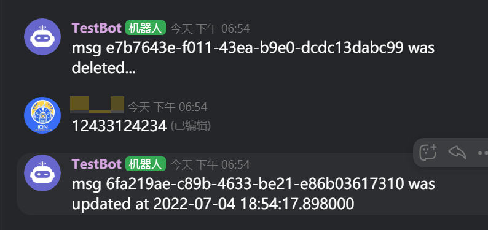

# example 05 开点小灶：事件处理

现在我们的 Bot 可以用 send/reply 等等功能来给服务器发消息，也可以用指令来响应服务器发来的消息，可以说机器人也好好的长大成人，没有什么基本能力问题了

不过就像是湘菜师傅干了十几年就可能会想想不放辣椒的菜是什么口味，我们也会自然地想想我们的 Bot 还可以有什么功能和能力，所以该开点小灶了

这里我们来讲讲 khl 中「看不见」的那些神奇功能

## 时时清醒：修改消息提醒

有的时候，你可能会多次编辑某一条消息，乃至于忘记自己什么时候修改过这个消息。这时候就可以让机器人登场，来提醒你消息已经被修改过啦！

看`ex05.py`的18-19行，这里设置了需要Bot观测的Event事件`UPDATED_MESSAGE`(消息更新)

~~~python
@bot.on_event(EventTypes.UPDATED_MESSAGE)
async def update_reminder(b: Bot, event: Event):
~~~

使用`b.fetch_public_channel`功能可以获取到发生`event`的`Channel Object`（利用**频道ID**访问khl后台获取`Channel Object`）

> 查看官方API文档[【频道相关事件】](https://developer.kaiheila.cn/doc/event/channel#%E9%A2%91%E9%81%93%E6%B6%88%E6%81%AF%E6%9B%B4%E6%96%B0)，就可以看到`event.body`的字段结构；也可以使用`print(event.body)`打印出字段结构。`body`中的`channel_id`就是`event`发生的地点（即发生了消息修改事件的文字频道）

在用`datetime.fromtimestamp`转换时间戳为正常时间格式，确认消息更新的时间后，我们让Bot向发生这个`event`的频道发送一条提醒消息

~~~python
    channel = await b.fetch_public_channel(event.body['channel_id'])
    updated_at = datetime.fromtimestamp(event.body["updated_at"] / 1000)  # ms timestamp -> POSIX timestamp
    await b.send(channel, f'msg {event.body["msg_id"]} was updated at {updated_at}')
~~~

## 小心谨慎：删除消息提醒

除了可以观测消息更新之外，Bot还可以得知那一条消息被删除了，并向删除了消息的频道发送一条提醒

~~~python
async def delete_catcher(b: Bot, event: Event):
    channel = await b.fetch_public_channel(event.body['channel_id'])
    await b.send(channel, f'msg {event.body["msg_id"]} was deleted...')
~~~

我们可以将这个函数添加为一个需要处理的事件，方便下次让Bot在另外一个地方调用这个事件

~~~python
bot.add_event_handler(EventTypes.DELETED_MESSAGE, delete_catcher)
~~~

---

下面是一个删除/修改消息提醒的示例图

