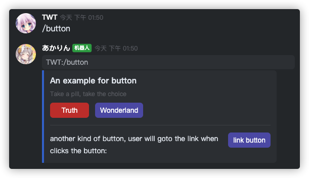

# example 07 摆盘：卡片消息（CardMessage）

教程到这里，大部分的功能其实都已经讲完了，我们这个教程也会转向对设计理念（khl.py 的一些接口设计 / khl 自身一些功能设计）的解释

比如这次讲的这个卡片消息，设计初衷有这么几点：

- 为了让用户与机器人的交互更加友好
- 为了提供更多、更灵活的交互形式

说这些可能有点虚，我们先来看看卡片消息是长什么样的：



_这个示例也包含在 ex07.py 中（/button）_

大家可以想象一下，用纯文本的形式来排版这些内容，交互体验和效果会怎么样

同时，卡片消息也提供了非常强大的按钮功能，这是纯文本很难实现的交互形式

## 接口概览 & 基础用法

卡片消息相关的所有 API 都包含在 khl.card 包中，卡片消息的入口是 CardMessage：

```py
from khl.card import CardMessage, Card

@bot.command()
async def minimal(msg: Message):
    cm = CardMessage(Card())
    await msg.reply(cm)
```

这是一个最小示例，一个 `CardMessage` 至少需要包含一个 `Card`，我们这里包含了一个空 `Card`

`Card` 里可以加些什么东西呢？大家可以先读一下[官方的文档](https://developer.kaiheila.cn/doc/cardmessage)

可以看到 `Card` 中有三个组件类：模块（在 khl.py 中对应 `Module`）、元素（对应 `Element`）和结构体（对应 `Struct`）

而每个组件类下又有细分功能的子组件，如果一一引入的话引入列表会太长，所以 khl.py 导出了三个组件类（`Module`, `Element`, `Struct`）用以统一定位子组件

具体用例请看 [ex07.py](./ex07.py)

## 杂项接口

### Types

在 khl 的卡片消息 API 中，有很多 enum 用以控制卡片表现，khl.py 遵循前文提到的「导出类统一定位」的设计方法，导出了 `Types` 类避免过长的引入列表

### Color

这是一个辅助组件，且大部分用到的地方都能通过传入 str/tuple 智能解析，所以不过多赘述，只需要留个印象：

> 用到 color 的地方支持三种等效的形式：
>
> - str（常用），如 '#5A3BD7' / '5A3BD7'（这两种形式都可以）
> - 三元组，如 (90, 59, 215)
> - Color 对象
